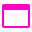
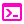
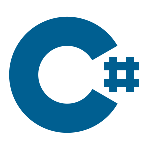
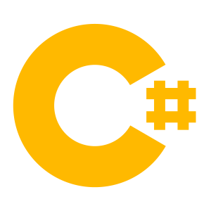
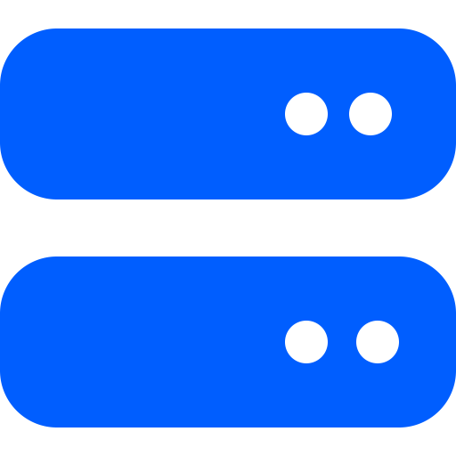
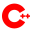
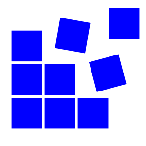

<div align="center">
<h1>Dasial Icons</h1>


</div>
A lightweight and stylish icon plugin to enhance your application's interface.

---


## Features

- Clean and modern icons
- Light and dark theme support
- Easy integration with any project
- Support SVG format

---

## Installation

### NPM Package Manager (if applicable)
```bash
npm install dasial-icons
```

| File Icons                                                   | File Type                   |
| -------------------------------------------------------------| ----------------------------|
|               | Default                     |
|                    | 3d                          |
|                   | App                         |
|                 | Applescript                 |
|                     | C                           |
|             | Changelog                   |
|                | Chrome                      |
|               | C Object                    |
|               | Console                     |
|               | Copilot                     |
|                   | Cpp                         |
|                    | Cs                          |
|                  | Disk                        |
|                | Docker                      |
|                | Gemini                      |
|                   | Git                         |
|                     | H                           |
|                   | Hpp                         |
|                | Hs                          |
|                  | HTML                        |
|           | Illustrator                 |
|                 | Image                       |
|               | Install                     |
|              | Istanbul                    |
|                  | Java                        |
|                    | Javascript                  |
|                  | Json                        |
|                   | Library                     |
|              | Makefile                    |
|             | Minecraft                   |
|                | Node JS                     |
|                   | NPM                         |
|            | Objective C                 |
|          | Objective Cpp               |
|             | Photoshop                   |
|            | Powershell                  |
|                | Readme                      |
|              | Registry                    |
|                   | Sln                         |
|                   | Svg                         |
|                 | Swift                       |
|                  | Text                        |
|                | Vscode                      |
