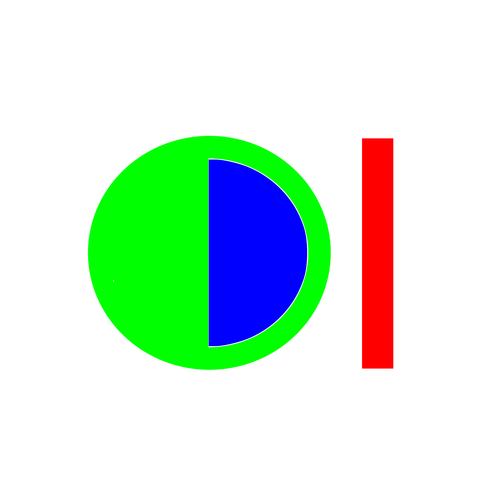

<div align="center">
<h1>Dasial Icons</h1>


</div>
A lightweight and stylish icon plugin to enhance your application's interface.

---


## Features

- Clean and modern icons
- Light and dark theme support
- Easy integration with any project
- Support SVG format

---

## Installation

### NPM Package Manager (if applicable)
```bash
npm install dasial-icons
```

<h1>File Icons</h1>

| Icons                                                        | Name                        |
| -------------------------------------------------------------| ----------------------------|
|              | Default                     |
|                   | 3d                          |
|                  | App                         |
|                | Applescript                 |
|                    | C                           |
|            | Changelog                   |
|               | Chrome                      |
|              | C Object                    |
|              | Console                     |
|              | Copilot                     |
|                  | Cpp                         |
|                   | Cs                          |
|                 | Disk                        |
|               | Docker                      |
|               | Eslint                      |
|               | Gemini                      |
|                  | Git                         |
|                    | H                           |
|                  | Hpp                         |
|               | Hs                          |
|                 | HTML                        |
|          | Illustrator                 |
|                | Image                       |
|              | Install                     |
|             | Istanbul                    |
|                 | Java                        |
|                   | Javascript                  |
|             | Js Config                   |
|                 | Json                        |
|                  | Library                     |
|              | License                     |
|             | Makefile                    |
|            | Minecraft                   |
|                 | MSIX                        |
|               | Node JS                     |
|                  | NPM                         |
|           | Objective C                 |
|         | Objective Cpp               |
|            | Photoshop                   |
|           | Powershell                  |
|               | Readme                      |
|             | Registry                    |
|               | Roblox                      |
|                  | Sln                         |
|                  | Svg                         |
|                | Swift                       |
|                 | Text                        |
|               | Vscode                      |

<h1>Folder Icons</h1>

| Icons                                                        | Name                        |
| -------------------------------------------------------------| ----------------------------|
|            | Default                     |
|             | Github                      |
|               | Root                        |